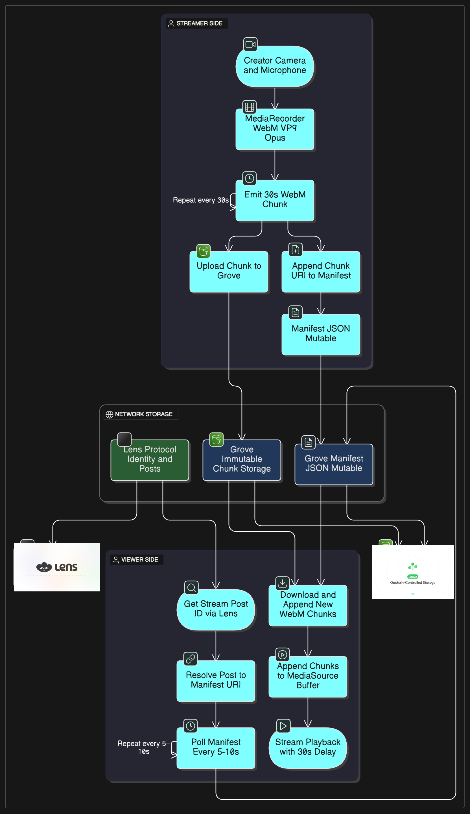

# 🌌 Lens Spaces

**Lens Spaces** is a decentralized live streaming platform built on top of **Grove storage** and the **Lens Protocol**. It enables creators to broadcast live, segment their streams into efficient WebM chunks, and publish them in real time — all while preserving decentralization and playback continuity. This is accomplished by heavy utilising and relying on Grove storage and it's editable feature.

---

## 🚀 Features

- 🎥 **Live Streaming** via `MediaRecorder` and WebM chunks
- ⛓️ **Decentralized Storage** powered by **Grove storage** entirely.
- 🔄 **Real-time Manifest Polling** for smooth progressive playback.
- 📦 **Chunk-based Streaming Architecture** (no monolithic video files) -> USP
- 🧠 **Lens-native User Profiles** for creator attribution
- 💬 **Live Chat, Reactions, and Viewer Interactions**
- 🧩 **Modular Codebase** with `StreamRecorder` and `StreamPlayer` classes

---

## 🧱 Architecture

```
[ Creator Camera/Mic ]
       │
       ▼
[ MediaRecorder ] — emits chunks every 30 seconds
       │
       ├── upload chunk → Grove (immutable, public) 
       └── update manifest by appending chunks → Grove (mutable)
       ▼
[ Manifest.json (with chunk URIs and metadata) ]
       │
       ▼
[ Viewer App ]
       │
       ├── Fetch manifest
       ├── Append chunks to MediaSource
       └── Smooth video playback
```

## Have a look at the flowchart for better understanding


<p align="center">
  
</p>

---

## 📦 Packages & Technologies

- **Next.js + React**
- **MediaRecorder API**
- **Grove Storage SDK** (`@/lib/lens/grove`)
- **Lens Protocol for identities**
- **Video streaming with `MediaSource`**
- **ConnectKit and Family support**
- **Lucide for Icons**

---

## 🛠️ Development Setup

```bash
# Clone the repo
git clone https://github.com/your-org/lens-spaces.git
cd lens-spaces

# Setup .env

cp .env.example .env


# Install dependencies
pnpm install

# Run locally
pnpm run dev
```

You'll need:
- Wallet (e.g. MetaMask)
- Testnet Lens profile
- Grove API access

---

## 🧪 Recording a Stream

1. Call `StreamRecorder.initializeStream(title, creator)`
2. Start the recording with `startRecording(mediaStream)`
3. Chunks are uploaded every `chunkDuration` ms
4. Manifest is updated after each chunk
5. Call `stopRecording()` to finalize the stream

```ts
const recorder = new StreamRecorder(address, signer, {
  chunkDuration: 30000, // 30s
});
await recorder.initializeStream("My Live Show", address);
await recorder.startRecording(myMediaStream);
```

---

## 📺 Playing a Stream

1. Initialize a `StreamPlayer` with the `streamUri` and `<video>` element
2. Chunks are appended dynamically as they're fetched
3. Manifest polling ensures playback stays up to date

```ts
const player = new StreamPlayer(videoElement, streamUri);
await player.initialize();
```

---

## 🗃️ Manifest Format (Example)

```json
{
  "version": "1.0",
  "title": "Test Stream",
  "creator": "0x123...",
  "startedAt": 1710000000000,
  "endedAt": 1710000900000,
  "chunkCount": 3,
  "chunks": [
    { "uri": "lens://abc...", "index": 0, "timestamp": 1710000000000 }, // each individual chunk is a 30 second video of the stream
    { "uri": "lens://def...", "index": 1, "timestamp": 1710000030000 }  // each individual chunk is a 30 second video of the stream.
  ],
  "status": "ended"
}
```

---

## 🧩 Folder Structure

```
/components        # UI components (Navbar, Chat, etc.)
/lib/lens          # Grove and Lens integrations
/pages             # Next.js routing and main pages
/stream.ts         # Core streaming logic (record + playback)
```

---

## 💡 Design Philosophy

- **Live-first**: optimized for real-time playback and chunk streaming
- **Composable**: decoupled recorder/player logic for flexible integrations
- **Decentralized**: content stored in Grove, linked via Lens
- **Developer-friendly**: typesafe, event-driven, and debuggable

---

## 🔐 Permissions & Access

- Chunks are stored **immutably and publicly**
- Manifests use **mutable ACLs**, editable only by the creator(Aka the app itself)
- Uses `WALLET_ADDRESS`-based ACLs to secure updates

---

## 📣 Roadmap Ideas

- [X] Stream tipping via Lens Collect
- [ ] Token-gated streams
- [ ] Adaptive bitrate support
- [ ] Transcoding support
- [ ] Mobile optimized UI
- [ ] Export stream as downloadable VOD

---

## 🙌 Credits

Built with ❤️ using:
- [Grove Storage](https://grove.lens.xyz)
- [Lens Protocol](https://lens.xyz)
- [Web APIs](https://developer.mozilla.org/en-US/docs/Web/API/MediaRecorder_API)

---

## 🪪 License

MIT © 2025 Lens Spaces